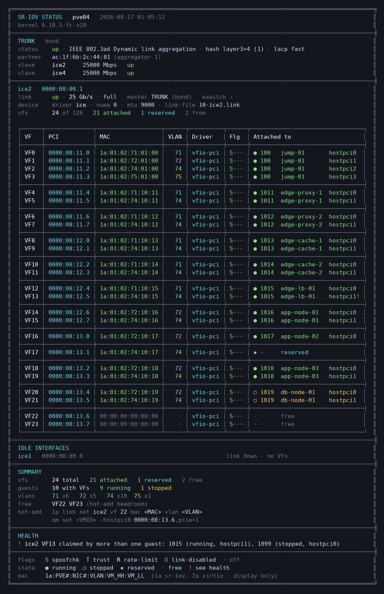

# sriov-status

`sriov-status.sh` — a single-file, dependency-light status display for SR-IOV Virtual Functions on Linux, with automatic guest-ownership mapping on Proxmox VE.

Nothing is statically configured. Physical functions, PCI addresses, bond/bridge masters, VF state and guest ownership are all discovered at runtime, so the same script works unmodified on every host in a cluster.



## Why

`ip link show` tells you a VF exists. It does not tell you which guest owns it, whether the guest is running, whether two guest configs are fighting over the same address, or whether a `vfio-pci` binding has been orphaned by a deleted VM. This fills that gap.

## Features

- **Auto-discovery of PFs** — any interface exposing `sriov_totalvfs`. Works with `ice`, `i40e`, `mlx5`, `bnxt` and anything else that implements the standard sysfs interface.
- **Real PCI addresses** read from `device` and `virtfn*` symlinks, never constructed from assumptions.
- **Guest ownership** resolved from `/etc/pve/qemu-server/*.conf` and `/etc/pve/lxc/*.conf`, including `hostpciN: mapping=` resource mappings, semicolon-separated multi-device entries, and short-form PCI addresses.
- **Container support** — bridge/veth NICs are listed, and LXC `phys` netdev handoffs (`lxc.net.N.type: phys`) are resolved by host interface or by `hwaddr`.
- **Bond and bridge detail** — master discovered from sysfs, then LACP mode, hash policy, partner MAC, aggregator ID and per-slave speed/MII.
- **Health checks** — duplicate MACs, ownership conflicts, orphaned `vfio-pci` bindings, dangling config references, `trust on` + `spoofchk off`, disabled link states, unconfigured VFs.
- **Hot-add guidance** — reports the next free VF and prints the exact `ip link` and `qm set` commands, including the reminder that `spoofchk` will drop traffic from a VF whose MAC was never set.
- **Content-driven layout** — column widths are computed from the data, so guest names are not truncated when they fit. The whole report sits inside a single frame that adapts to the widest line.
- **Adaptive presentation** — Unicode or ASCII box drawing chosen from locale and `TERM`; wide or 80-column layout chosen from terminal width; colour disabled automatically when piped or when `NO_COLOR` is set.
- **`--json`** for monitoring, and **`--watch`** for a live view with changed lines highlighted.

## Requirements

- bash 4.3 or newer
- `iproute2` (`ip`)
- Optional but recommended: `ethtool` (firmware/driver version), `lspci` (model name), `devlink` (eswitch mode)
- Root, or read access to `/etc/pve`, for guest ownership. Without it the tool still runs and simply omits the ownership column.

No Python, no `jq`, no compiled dependencies.

## Install

```bash
git clone https://github.com/jagmeets1ngh/linux.git
cd linux/sriov-status
sudo ./install.sh
```

Or by hand:

```bash
sudo install -m 0755 sriov-status.sh /usr/local/sbin/sriov-status
```

## Usage

```
sriov-status                    # everything, auto-formatted
sriov-status -i ice2            # one PF
sriov-status --by-vm            # group by guest instead of by VF
sriov-status --watch 5          # live, 5s refresh, q to quit
sriov-status --json | jq .      # machine-readable
sriov-status --no-vm            # skip guest scanning entirely
sriov-status --ascii --compact  # force plain 80-column output
```

| Flag | Effect |
|---|---|
| `-i, --iface NAME` | Restrict to one PF (comma-separated for several) |
| `--by-vm` | Add a per-guest section listing VFs and virtio NICs |
| `--no-vm` | Do not read guest configs |
| `--json` | Emit the full model as JSON and exit |
| `--watch [SEC]` | Continuous refresh, default 2s |
| `-v, --verbose` | Include informational notes in the Health section |
| `--wide` / `--compact` | Keep or drop the Driver column |
| `--width N` | Assume terminal width N instead of detecting it |
| `--unicode` / `--ascii` | Force box-drawing style |
| `--no-color` | Disable colour (also honours `NO_COLOR`) |

### Flags column

| Letter | Meaning |
|---|---|
| `S` | `spoofchk on` |
| `T` | `trust on` |
| `R` | `max_tx_rate` is set |
| `D` | link-state administratively disabled |
| `·` / `.` | that flag is off |

### VF states

Every VF lands in exactly one state. The distinction that matters most is
**reserved** vs **free**: a reserved VF has a MAC and VLAN configured and is
waiting for a guest, so it is inventory, not a fault.

| Marker | State | Meaning |
|---|---|---|
| `●` / `*` | running | a guest config claims this VF and the guest is running |
| `○` / `o` | stopped | a guest config claims this VF, guest is not running |
| `▪` / `-` | reserved | MAC and VLAN configured, no guest claims it yet |
| `·` / `.` | free | no MAC configured, available for hot-add |
| `!` | — | see the Health section |

A VF bound to `vfio-pci` is **not** evidence that anything is using it. Most
hosts bind `vfio-pci` by device id, so every VF is vfio-bound from the moment
it is created. Real ownership is proved only by an open `/dev/vfio/<group>`
handle, which is what the `held` check looks for in `/proc/*/fd`.

## Health checks

| Severity | Check |
|---|---|
| `!` | Two VFs share a MAC address |
| `!` | One VF referenced by more than one guest config |
| `!` | vfio group is open by a running process but no guest config claims the VF |
| `!` | `trust on` combined with `spoofchk off` |
| `!` | Guest config references a PCI address not present on this host |
| `!` | Guest references a VF that has no MAC configured |
| `~` | VF has a MAC but no VLAN — traffic will be untagged |
| `~` | VF link-state administratively disabled |
| `~` | PF link is not up |
| `i` | PF is SR-IOV capable but has no VFs enabled (shown with `-v`) |
| `i` | PF link is down (shown with `-v`) |

Repeated findings collapse onto one line with the VF numbers compressed into
ranges, so twelve identical warnings read as `ice2 VF6-13,16-19` rather than
twelve lines. Informational notes are hidden unless you pass `-v`.

## JSON schema

```json
{
  "generator": { "name": "sriov-status.sh", "version": "1.0.1" },
  "host": "pve04",
  "timestamp": "2026-08-16T13:33:11-07:00",
  "pfs": [
    {
      "name": "ice2", "pci": "0000:08:00.1", "driver": "ice",
      "firmware": "4.60 0x8001d1c5 1.3722.0", "model": "...",
      "numvfs": 24, "totalvfs": 128,
      "master": "TRUNK", "master_kind": "bond",
      "eswitch": "legacy", "link_file": "10-ice2.link",
      "numa": 0, "mtu": 9000,
      "operstate": "up", "speed_mbps": 25000, "duplex": "full",
      "vfs": [
        {
          "index": 0, "pci": "0000:08:11.0",
          "mac": "1a:01:02:71:01:00", "vlan": 71,
          "spoofchk": "on", "trust": "off",
          "link_state": "auto", "max_tx_rate": 0,
          "driver": "vfio-pci", "iommu_group": "142",
          "state": "running",
          "guest": {
            "id": 100, "name": "jump-01", "type": "qemu",
            "state": "running", "slot": "hostpci0", "conflict": false
          }
        }
      ]
    }
  ],
  "issues": [ { "severity": "err", "scope": "ice2 VF13", "message": "..." } ]
}
```

`state` is one of `running`, `stopped`, `held`, `reserved`, `free`. `guest` is `null` for unowned VFs. `vlan` and `speed_mbps` are `null` when unset.

### Prometheus textfile export

```bash
sriov-status --json | python3 -c '
import json,sys
d=json.load(sys.stdin)
for pf in d["pfs"]:
    for v in pf["vfs"]:
        g = v["guest"]
        lbl = f'"'"'pf="{pf["name"]}",vf="{v["index"]}",pci="{v["pci"]}",guest="{g["id"] if g else ""}"'"'"'
        print(f"sriov_vf_attached{{{lbl}}} {1 if g else 0}")
print(f"sriov_issues_total {len(d[\"issues\"])}")
' > /var/lib/node_exporter/textfile/sriov.prom
```

## Notes on VF assignment

VF configuration is not persistent across a PF reset. Set MAC, VLAN, spoofchk and trust from a systemd unit (or a `sriov-numvfs` drop-in) that runs before guests start.

A VF with no MAC receives a kernel-assigned random one on every reset. With `spoofchk on`, a guest attached to such a VF will have its traffic silently dropped. Always set MAC and VLAN before attaching:

```bash
ip link set ice2 vf 22 mac 1a:01:02:71:10:20
ip link set ice2 vf 22 vlan 71
ip link set ice2 vf 22 spoofchk on
ip link set ice2 vf 22 trust off
qm set 1020 -hostpci0 0000:08:13.6,pcie=1
```

### systemd unit hygiene

If you configure VFs from a `systemd` unit, verify it parses cleanly. A bare line without a leading `#` is not a comment — systemd logs `Unknown key name` and skips it on every boot:

```bash
systemd-analyze verify /etc/systemd/system/e810-sriov.service
systemd-analyze verify /etc/systemd/system/x710-sriov.service
```

### LXC and VFs

PCI passthrough is a VM concept; a container shares the host kernel and has no separate IOMMU domain. What you can do is move a VF's *netdev* into the container's network namespace:

```
lxc.net.1.type: phys
lxc.net.1.link: <vf-netdev-name>
lxc.net.1.hwaddr: 1a:01:02:71:10:50
```

This is not exposed in the Proxmox GUI. The VF's `vf N` line remains visible under the PF (it comes from the PF's VF table, which stays in the host namespace); what disappears from the host is the `iavf` netdev. `sriov-status` resolves these by interface name where possible and by `hwaddr` otherwise.

## Testing

The script accepts path-root overrides so it can be exercised against a synthetic host with no hardware present. This is what CI uses.

```bash
tests/make-mock.sh /tmp/mock
tests/smoke.sh /tmp/mock
```

| Variable | Default |
|---|---|
| `E810_SYS_NET` | `/sys/class/net` |
| `E810_SYS_PCI` | `/sys/bus/pci/devices` |
| `E810_PVE_DIR` | `/etc/pve` |
| `E810_PROC_BOND` | `/proc/net/bonding` |
| `E810_NET_DIR` | `/etc/systemd/network` |
| `E810_RUN_QEMU` | `/run/qemu-server` |
| `E810_CGROUP_LXC` | `/sys/fs/cgroup` |
| `E810_IP` | `ip` |

## MAC addressing

The tool never infers ownership from MAC bytes — ownership always comes from guest configuration. A site scheme is still useful for humans, and the legend line displays one:

```
1a:PVE#:NIC#:VLAN_ID:VM_HH:VM_LL     1a = SR-IOV VF
2a:PVE#:NIC#:VLAN_ID:VM_HH:VM_LL     2a = virtio
```

Both `1a` and `2a` have the locally-administered bit set and the multicast bit clear, which is what you want for assigned addresses.

## Licence

MIT. See [LICENSE](LICENSE).
